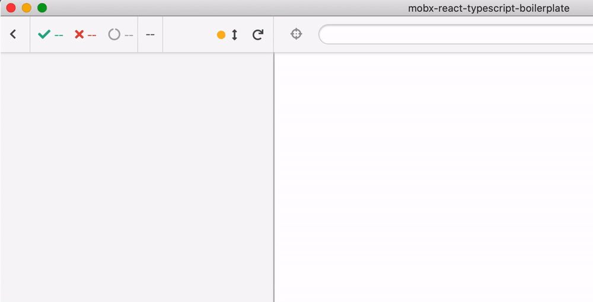

# React-TypeScript

Forked from [mobxjs/mobx-react-typescript-boilerplate](https://github.com/mobxjs/mobx-react-typescript-boilerplate)

Minimal boilerplate for a single-page app using MobX, React and TypeScript with TSX and component testing with Cypress and [cypress-react-unit-test](https://github.com/bahmutov/cypress-react-unit-test)

```js
// src/TimerView.cy-spec.tsx
import * as React from 'react'
import { mount } from 'cypress-react-unit-test'
import AppState from './AppState'
import TimerView from './TimerView'

describe('TimerView', () => {
  it('shows the timer', () => {
    const appState = new AppState()
    mount(<TimerView appState={appState} />)

    // wait until the counter increments
    cy.contains('button', 'Seconds passed: 2').click()

    // resets
    cy.contains('button', 'Seconds passed: 0')
    cy.wrap(appState.timer).should('equal', 0)

    // again the count continues
    cy.wrap(appState).its('timer').should('equal', 3)
  })
})
```



## Tests

Name | Description
--- | ---
[AppState.cy-spec.ts](src/AppState.cy-spec.ts) | Testing a class that uses `@observable` class decoration
[TimerView.cy-spec.tsx](src/TimerView.cy-spec.tsx) | Passing an observable class as a property to the component
[SmartTodo.cy-spec.tsx](src/SmartTodo.cy-spec.tsx) | Tests a component that uses `useLocalStore` hook

## Run

```shell
npm install
npm run cy:open
```
